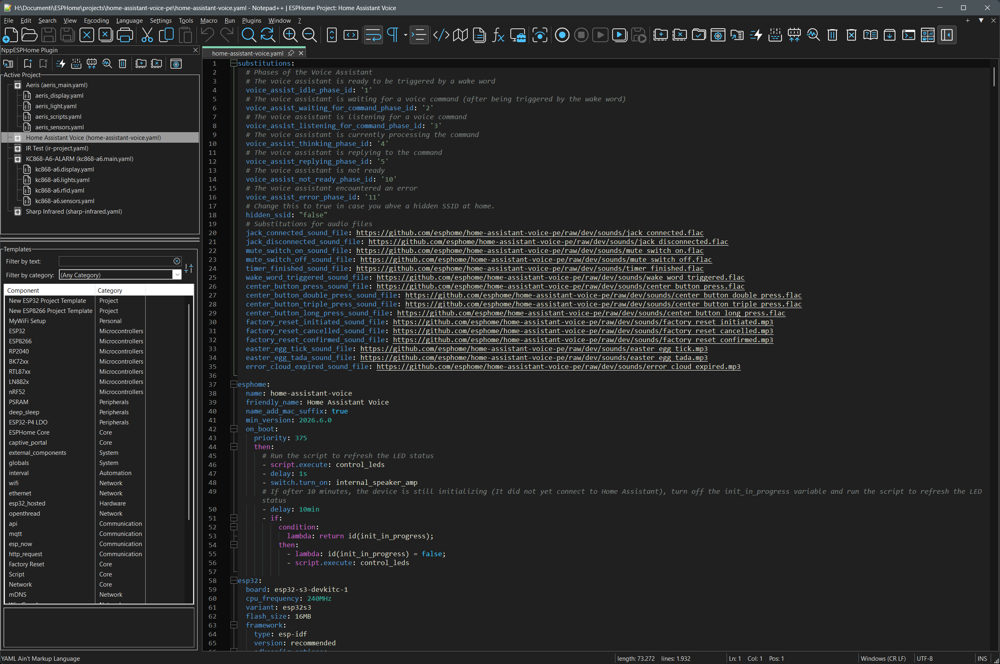

# Dockable Window — Dark Mode

[← Back to README](../../README.md#screenshots) · [View Light mode →](dockable-light.md)

[← Back to README](../../README.md#screenshots) · [View Light mode →](dockable-light.md)
