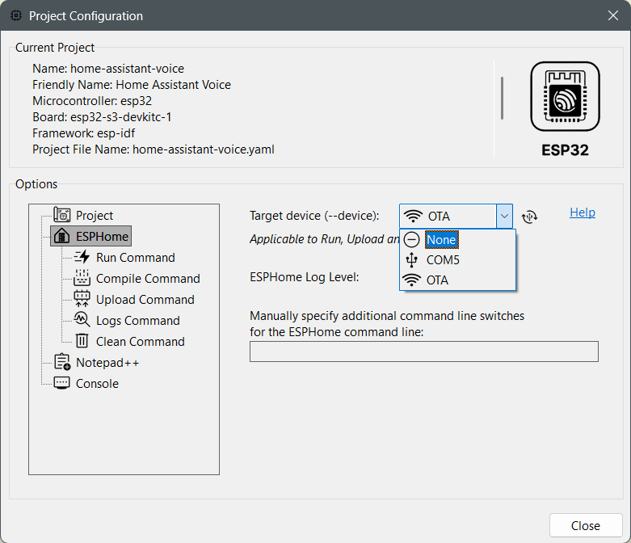

# Project Configuration — Light Mode

[← Back to README](../../README.md#screenshots) · [View Dark mode →](project-configuration-dark.md)

[← Back to README](../../README.md#screenshots) · [View Dark mode →](project-configuration-dark.md)
