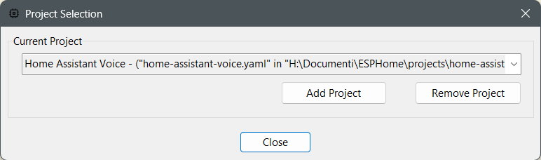

# Project Selection — Light Mode

[← Back to README](../../README.md#screenshots) · [View Dark mode →](project-selection-dark.md)

[← Back to README](../../README.md#screenshots) · [View Dark mode →](project-selection-dark.md)
