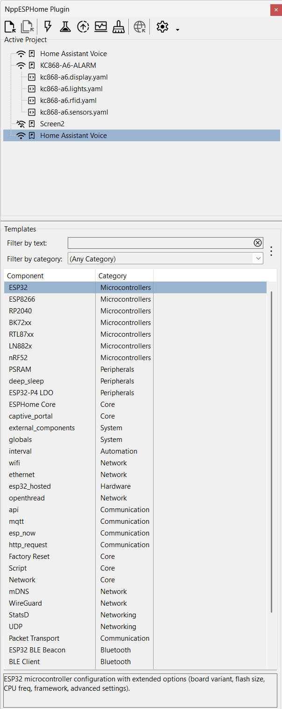

# NppESPHome-Plugin

A Notepad++ plugin written in Delphi to directly interact with ESPHome and easily manage related projects in Windows environment.

## Why?

After discovering the potential of ESPHome, I started working on several projects and immediately ran into the lack of a tool that would help me speed up the development workflow, including writing YAML code and performing related testing.
Despite the power of the command line provided by both Python and ESPHome itself, I needed something that would save me from repeatedly rewriting the same commands, even if they were very simple.

At first, I developed a Windows application that acted as a wrapper, but I soon realized that by relying exclusively on Notepad++ for code editing, I could create a plugin that would make interaction with ESPHome commands immediate and straightforward.

That’s how the idea for this plugin was born.

## Features

* Streamlined workflow – Designed around the ESPHome project concept, the plugin ensures a smooth, intuitive, and productive development experience.

* Project configuration dialogs – Quickly select and configure your current project with dedicated setup windows directly inside Notepad++.

* One-click ESPHome commands – Automatically generates command lines for Run, Compile, Upload, Clean, and Logs. All commands are accessible from the plugin menu or can be assigned to custom keyboard shortcuts in Notepad++.

* Smart YAML validation – Parses your project’s YAML file to check validity and detect whether it includes Online or WebServer features.

* Flexible device communication – Configure ESP device communication ports with automatic detection of active serial and network connections, making uploads and interaction effortless.

* Command customization – Personalize options for each ESPHome command and save them with your project settings.

* Advanced configuration – Control logging behavior, automatic console closing, and define custom command-line arguments for advanced workflows.

* Auto-save integration – Automatically saves your project files before executing ESPHome commands, helping you keep focus on development.

* Multi-source management – Supports a project dependency file, enabling simultaneous editing of multiple sources within the same project, with multi-file open and save to boost productivity.

* Custom Notepad++ toolbar – An integrated, customizable toolbar provides direct access to the plugin’s main commands and functions.

* Extra utilities – Includes handy non-ESPHome features such as:
    - Opening the official ESPHome web documentation
    - Updating ESPHome to the latest version
    - Launching a command prompt or file explorer directly from the project folder

## What it doesn't do

The plugin does not replace ESPHome but makes interaction with it easier.

For it to work, ESPHome must be installed on the system and its executables must be included in the user or system PATH.

Naturally, the plugin is designed for Notepad++, and therefore requires Notepad++ to be installed (version 8.0 or higher is needed to use the toolbar).

