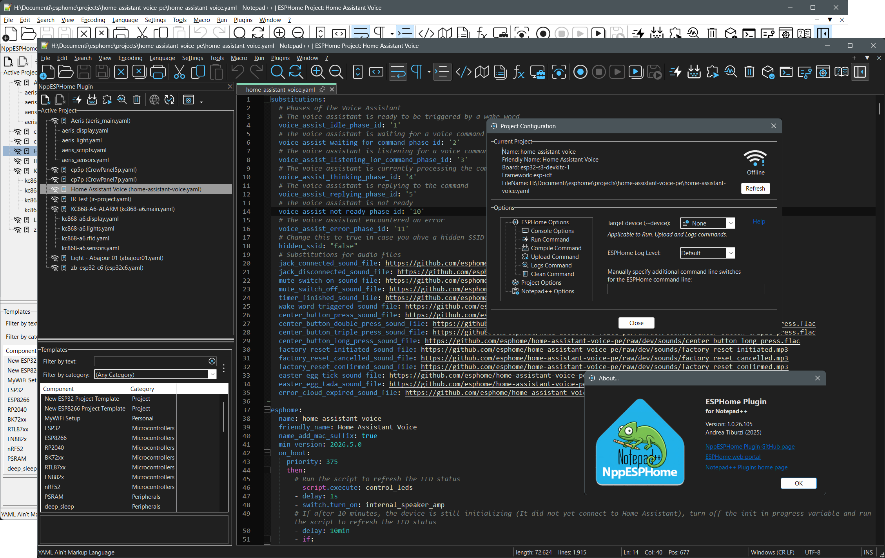
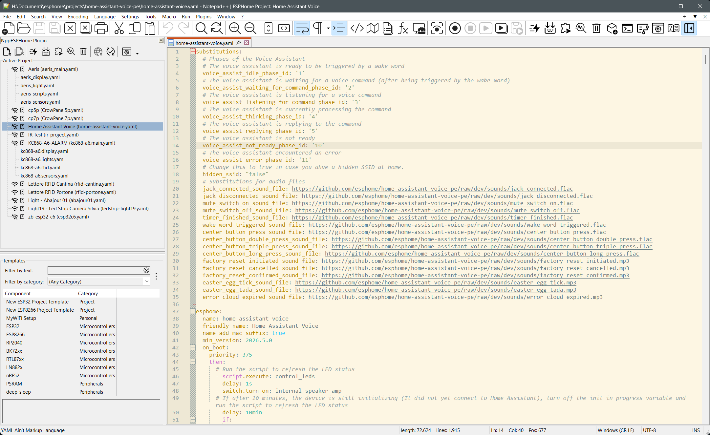
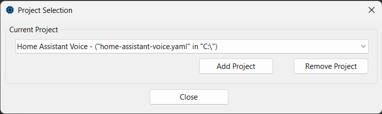
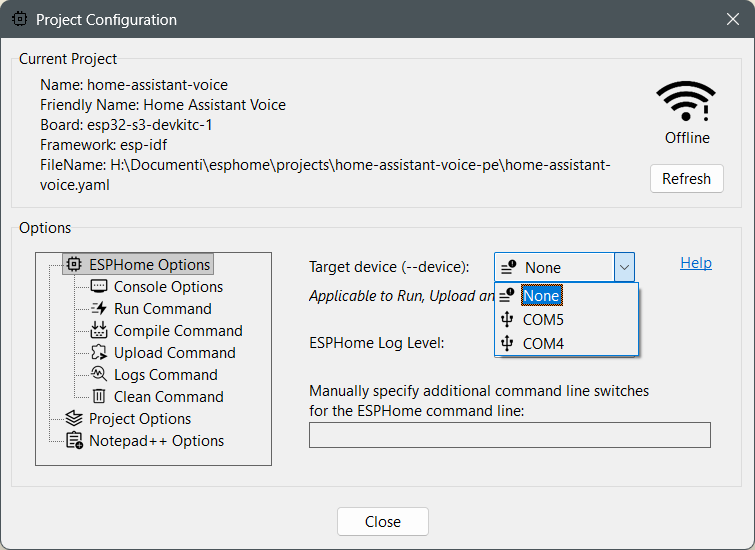
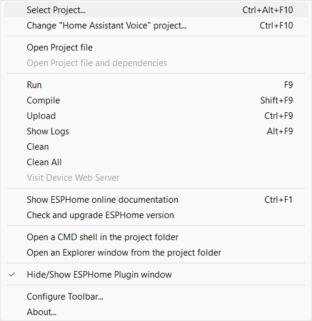
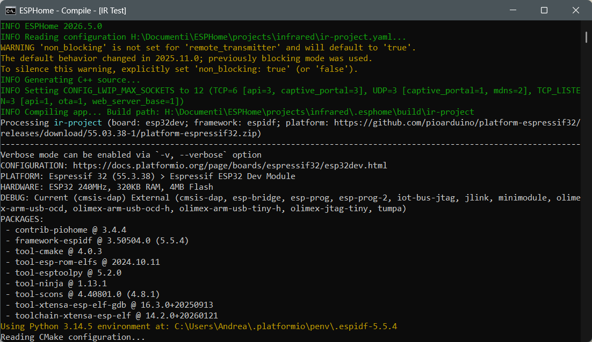
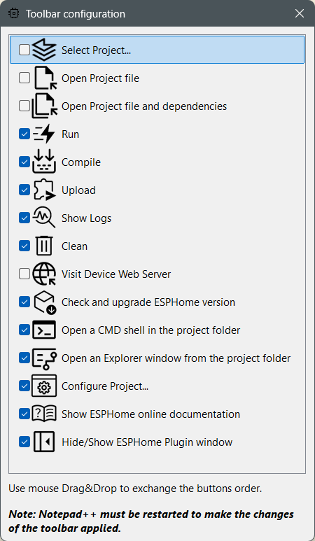

# NppESPHome Plugin

   

  
  
  
  
  

  
  
  

A polished **Notepad++ plugin** written in **Delphi** that brings **[ESPHome](https://github.com/esphome/esphome)** workflows closer to the editor on Windows.

It reduces the friction of routine ESPHome tasks by centralizing project selection, configuration, command execution, and template insertion directly inside Notepad++. The result is a tighter, faster, and more predictable workflow for users who already rely on Notepad++ as their main editor.

---

## Quick Summary

- Built for **Windows**
- Integrates directly with **Notepad++**
- Designed for **[ESPHome](https://github.com/esphome/esphome)** project workflows
- Automates **Run / Compile / Upload / Logs / Clean / Clean-All**
- Supports **project-specific settings**
- Includes **dockable UI**, **toolbar**, and **template tools**
- Supports both **Light** and **Dark** modes
- Requires **ESPHome to be already installed**

---

## Why it Exists

ESPHome is powerful, flexible, and productive, but because it only has a command-line interface, it can become repetitive and annoying to use.

When working on development, it is common to:
- Repeat the same command-line calls
- Reopen the same YAML files and dependencies
- Switch constantly between editor, shell, and file manager
- Reconfigure the same options across sessions

This plugin was created to reduce that friction.

Instead of using Notepad++ only as a text editor while depending on command line for the rest, **NppESPHome Plugin** turns Notepad++ into a practical ESPHome IDE. It does not replace ESPHome itself; it simply makes ESPHome easier to use inside an editor-centric workflow.

---

## What it Does

The plugin focuses on the parts of ESPHome development that benefit most from direct editor integration:

- Project selection and switching
- Per-project configuration
- One-click command execution
- Template-based code insertion
- Console behavior control
- Persistent UI layout
- Handy utility shortcuts for documentation and system tools

It is designed to be useful both for small personal projects and for larger sets of ESPHome devices where consistency and speed matter more over time.

---

## Features

### Streamlined workflow

The plugin is built around the concept of an ESPHome **project**, making the workflow smoother, more intuitive, and more productive than repeatedly working from the command line alone.

### Project configuration dialogs

Quickly select and configure your current project using dedicated dialogs directly inside Notepad++.

### One-click ESPHome commands

The plugin automatically generates the correct command line for the current project and lets you launch:

- **Run**
- **Compile**
- **Upload**
- **Logs**
- **Clean**
- **Clean-All**

These actions are available from:
- The plugin menu
- Toolbar buttons
- The floating window
- Custom keyboard shortcuts in Notepad++

### Console positioning control

Options to control the ESPHome console behaviour include:

- **Console Solo Mode** to terminate existing processes before starting a new one
- **Position on the screen** options
- **Custom monitor** placement support
- **Always On Top** support

### UI and usability improvements

The plugin includes several quality-of-life enhancements:

- Persistent layouts
- Customizable toolbar
- Full support for Light and Dark themes

### Smart YAML validation

The plugin parses project YAML files to validate structure and detect whether they include features such as Online access or WebServer support.

### Flexible device communication

Communication ports can be configured with automatic detection of active serial and network connections, making device interaction and uploads easier to manage.

### Command customization

You can personalize options for each ESPHome command and store them as part of the current project configuration.

### Advanced configuration

Fine-tune logging behavior, automatic console closing, and custom command-line arguments for more advanced workflows.

### Auto-save integration

Project files can be automatically saved before running ESPHome commands, helping keep development flow uninterrupted.

### Multi-source management

The plugin supports dependency files, allowing simultaneous editing of multiple related sources in the same project. Multi-file open and save operations are included to improve productivity.

### Custom Notepad++ toolbar

An integrated toolbar provides quick access to the plugin’s most important actions and can be customized to fit your preferred workflow.

### Templates for ESPHome components

A dockable template window displays a customizable list of ESPHome components, making it easy to insert reusable snippets and speed up YAML editing.

### Full Light and Dark mode support

All plugin windows and the toolbar are designed to work correctly in both Notepad++ Light and Dark modes.

### Extra utilities

Additional non-ESPHome helper functions include:

- Opening the official ESPHome web documentation
- Updating ESPHome to the latest version
- Launching a command prompt from the project folder
- Opening File Explorer directly in the project folder

---

## Feature Matrix

| Capability | Status | Notes |
|---|---:|---|
| Project selection | Included | Active project determines command target |
| Per-project settings | Included | Stored in `NppESPHome.ini` |
| Run / Compile / Upload / Logs / Clean | Included | Available from menu, toolbar, shortcuts, and floating window |
| Clean All | Included | Deeper cleanup support |
| Console Solo Mode | Included | Prevents overlapping processes |
| Console auto-close | Included | Optional behavior |
| Console placement control | Included | Better command window handling |
| YAML parsing and checks | Included | Feature-aware validation support |
| WebServer / Online detection | Included | Based on project YAML |
| Serial / network port detection | Included | Helps with uploads and logs |
| Dependency-aware project handling | Included | Supports multi-file workflows |
| Template browser | Included | XML-based and customizable |
| Toolbar integration | Included | Requires Notepad++ 8.0+ |
| Light mode support | Included | Fully supported |
| Dark mode support | Included | Fully supported |
| Documentation shortcut | Included | Opens official ESPHome docs |
| ESPHome update shortcut | Included | Utility command |
| Multilingual UI | Planned | Architecture already prepared |

---

## Typical Workflow

A common workflow with the plugin looks like this:

1. Select one or more ESPHome projects through **Select Project**
2. Choose the active project
3. Configure project-specific behavior through **Configure Project**
4. Open the main YAML file or its dependencies
5. Develop your YAML code in Notepad++
6. Run **Compile**, **Upload**, **Logs**, or **Run** directly from the plugin
7. Use templates and utility actions to speed up repetitive work

This tighter edit-test-run loop is the main value of the plugin.

---

## Screenshots

| Main window | Project configuration | Configuration |
|---|---|---|
|  |  |  |

| Menu integration | Console execution | Toolbar configuration |
|---|---|---|
|  |  |  |

---

## Application Windows

<strong>Select Project</strong>

When the plugin starts, it reads the list of previously added ESPHome projects from the configuration file and restores them. One project is treated as the **active project**, and that project becomes the target for the main commands.

From **Plugins → NppESPHome → Select Project**, you can:

- Choose the active project
- Add a new project by selecting its YAML file
- Remove a project from the list of known projects

This keeps switching between device configurations quick and predictable.

<strong>Configure Project</strong>

Once the current project has been selected, you can define how the plugin should interact with both ESPHome and Notepad++.

Typical options include:

- Auto-save behavior
- Console handling preferences
- Custom command-line parameters
- Logging configuration
- Execution behavior
- Auto-close settings

These settings are stored on a per-project basis, which makes it easy to adapt the plugin to different devices and workflows.

<strong>Floating Window</strong>

The floating window acts as a compact control center inside Notepad++.

It combines:

- Project navigation
- Quick command access
- Dependency visibility
- Template browsing
- Snippet insertion

The goal is to keep the most useful actions close at hand without interrupting editing.

<strong>ESPHome Commands</strong>

The plugin gives you direct access to the five main ESPHome commands:

- Run
- Compile
- Upload
- Logs
- Clean
- Clean-All

Normally, in a Windows shell, you would need to invoke `esphome.exe` manually and provide the correct sequence of parameters. The plugin automates that process by generating the command line from the selected project and its saved configuration.

The command runs in a Windows console that can remain open or close automatically depending on your chosen settings.

---

## What it Does and Does Not Do

The plugin does **not** replace ESPHome.  
It simplifies interaction with ESPHome directly from Notepad++.

To work correctly, the following requirements must already be met:

- **ESPHome must already be installed on your system**
- **Notepad++ must also be installed**
- **Notepad++ 8.0 or higher** is recommended and required for toolbar support

ESPHome installation guide:  
[https://www.esphome.io/guides/installing_esphome/](https://www.esphome.io/guides/installing_esphome/)

If ESPHome is not found during Notepad++ startup, the plugin will display an error message.

---

## Installation

If you simply want to use the plugin and do not plan to compile it yourself, you can download the DLL here:

[Download the DLL](https://github.com/atiburzi/NppESPHome-Plugin/tree/main/Bin)

The plugin DLL must be placed in the `plugins` subfolder of the Notepad++ installation folder, inside the subfolder with the same name as the plugin binary without the file extension, according to this guide:

[Notepad++ manual plugin installation guide](https://npp-user-manual.org/docs/plugins/#install-plugin-manually)

### Important

- Use the DLL architecture that matches your Notepad++ installation (**x86 / x64**)
- ESPHome must already be installed
- If ESPHome is not detected at startup, the plugin will show an error

ESPHome installation guide:  
[https://www.esphome.io/guides/installing_esphome/](https://www.esphome.io/guides/installing_esphome/)

---

## Plugin Settings

Settings are stored in the default Notepad++ plugin settings folder in the file:

`NppESPHome.ini`

This file contains project data, active project state, layout information, and plugin preferences.

---

## Source Code

The source code is available here:

[The source](https://github.com/atiburzi/NppESPHome-Plugin/tree/main/Source)

It is written in **Delphi** and is made available primarily so that advanced users can build their own custom versions or inspect and adapt the implementation.

Contributions are welcome:

- Bug-fix pull requests are appreciated when they are reproducible or clearly useful
- Pull requests for new features are welcome
- The best way to start is by opening an issue first

Useful links:

- [Pull requests](https://github.com/atiburzi/NppESPHome-Plugin/pulls)
- [Issues](https://github.com/atiburzi/NppESPHome-Plugin/issues)

---

## License

The source code is released under the **MPL 2.0** license:

> Copyright © 2025 Andrea Tiburzi  
> This Source Code Form is subject to the terms of the Mozilla Public  
> License, v. 2.0. If a copy of the MPL was not distributed with this  
> file, You can obtain one at [http://mozilla.org/MPL/2.0/](http://mozilla.org/MPL/2.0/).

---

## Build Environment

NppESPHome Plugin has been compiled with **Delphi 12** and tested with the following versions:

- Notepad++ 8.8.3
- ESPHome 2025.3.0

It will likely work with older and newer versions as well, although those combinations are not fully documented here.

---

## Dependencies to Compile

Libraries used to implement the Notepad++ plugin were partially taken from [NppUISpy plugin for Notepad++ ver. 1.2](https://github.com/dinkumoil/NppUISpy/tree/master/src/Lib) and adapted for this project.

The following additional third-party libraries are required to compile the source:

- [JAM-Software Virtual-TreeView ver. 8.3](https://github.com/JAM-Software/Virtual-TreeView)
- [ComPort Library ver. 4.11](http://comport.sf.net/)
- [LibYAML ver. 0.2.5](https://github.com/yaml/libyaml)
- [JEDI Visual Component Library ver 3.50](https://github.com/project-jedi/jvcl)
- [Task Dialog Message Box with Fluent Interface](https://specials.rejbrand.se/dev/classes/TDMessageBox/TDMessageBox.html)

These libraries must be available in the Delphi default library search path.

---

## Future Enhancements

The plugin architecture already takes multilingual support into account, even though it is not implemented yet.

Possible future improvements include:

- More built-in templates
- Expanded diagnostics
- More automation helpers
- Better customization for larger project collections
- Localization support

---

## Final Note

If you use **Notepad++** as your primary editor and regularly work with **ESPHome** on Windows, this plugin is designed to make that workflow faster, smoother, and less repetitive.

It preserves the flexibility of ESPHome while making the most common actions much easier to reach.
