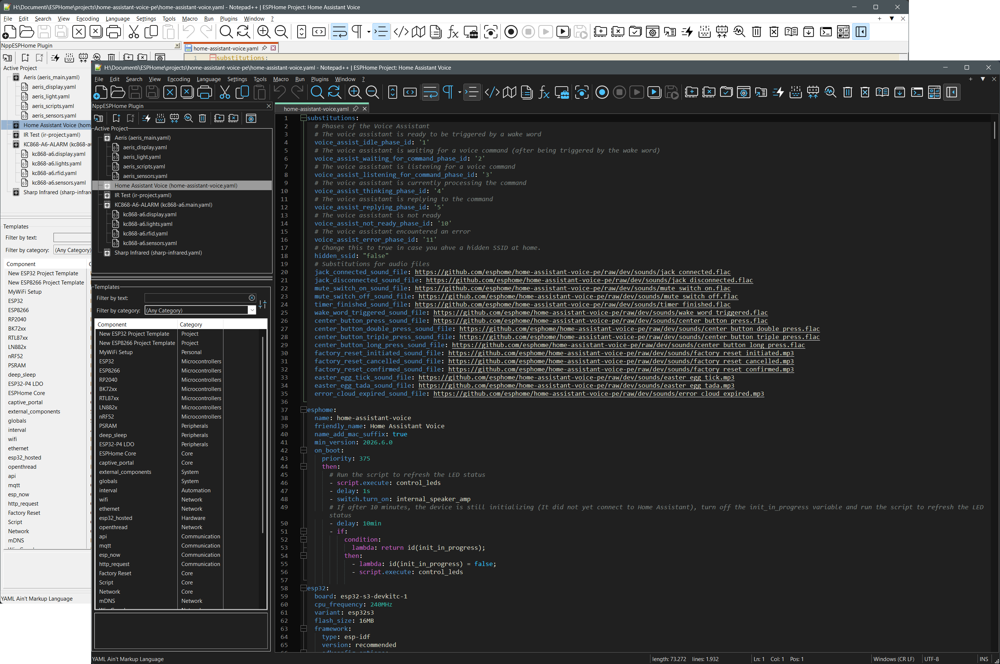
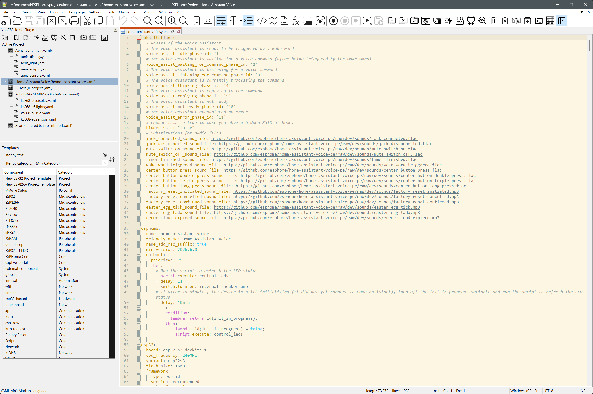
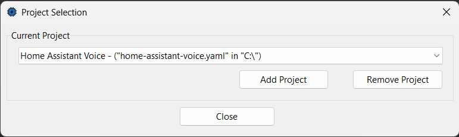
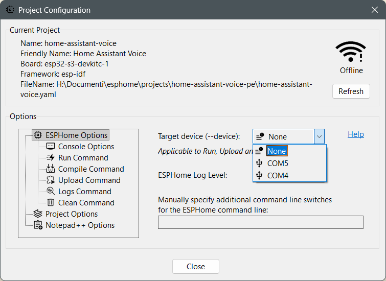
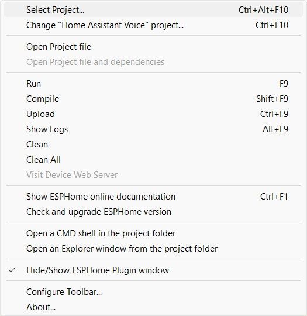
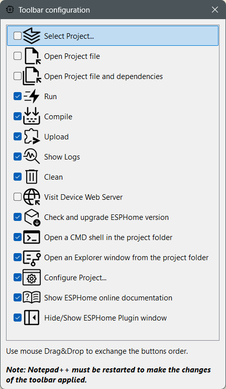

# NppESPHome Plugin

<p align="center">
  <br>
</p>

<p align="center">
  <a href="https://github.com/atiburzi/NppESPHome-Plugin">
    
  </a>
  <a href="https://notepad-plus-plus.org/">
    
  </a>
  <a href="https://github.com/esphome/esphome">
    
  </a>
  <a href="https://www.embarcadero.com/products/delphi">
    
  </a>
  <a href="http://mozilla.org/MPL/2.0/">
    
  </a>
</p>

<p align="center">
  <a href="https://github.com/atiburzi/NppESPHome-Plugin/tree/main/Bin">
    
  </a>
  <a href="https://github.com/atiburzi/NppESPHome-Plugin/issues">
    
  </a>
  <a href="https://github.com/atiburzi/NppESPHome-Plugin/pulls">
    
  </a>
</p>

NppESPHome is a Windows plugin written in Delphi that integrates common
[ESPHome](https://github.com/esphome/esphome) workflows into Notepad++. It
manages multiple projects and their related files, builds project-specific
ESPHome command lines, provides a configurable native toolbar, and inserts
reusable YAML snippets from an XML template library.

The plugin is a front end for the ESPHome command-line tools. It does not
replace ESPHome and does not include the ESPHome runtime.

---

## Highlights

- Multiple ESPHome projects with a persistent current-project selection
- YAML project validation and extraction of device metadata
- Manually managed dependency files for each project
- Direct **Run**, **Compile**, **Upload**, **Logs**, **Clean**, and
  **Clean-All** commands
- Per-project command, target, auto-save, and console options
- Dockable project and template window synchronized with the active document
- XML-based, searchable, and editable YAML template library
- Configurable Notepad++ toolbar with persistent order and visibility
- Light and Dark mode integration, including toolbar icon-set changes
- Shortcuts for ESPHome documentation, upgrade, terminal, and File Explorer

---

## Requirements

- Windows
- Notepad++ with the same architecture as the plugin DLL (`Win32` or `Win64`)
- ESPHome installed and `esphome.exe` available through the Windows `PATH`
- Notepad++ 8.0 or newer for custom toolbar configuration

The presence of `esphome.exe` is checked when an ESPHome command is invoked.
The **Upgrade ESPHome** utility also requires `pip.exe` to be available through
the `PATH`.

See the
[ESPHome installation guide](https://www.esphome.io/guides/installing_esphome/)
and the
[Notepad++ manual plugin installation guide](https://npp-user-manual.org/docs/plugins/#install-plugin-manually).

---

## Installation

1. Download the DLL for the architecture of your Notepad++ installation from
   the [`Bin` directory](https://github.com/atiburzi/NppESPHome-Plugin/tree/main/Bin).
2. Create a plugin subdirectory named `NppESPHome` below the Notepad++ plugin
   directory.
3. Copy the DLL to:

   ```text
   <Notepad++>\plugins\NppESPHome\NppESPHome.dll
   ```

4. Restart Notepad++.

The plugin creates its INI and template files in the configuration directory
provided by Notepad++ rather than beside the installed DLL.

---

## Getting Started

1. Choose **Plugins → NppESPHome → Add Project** and select an existing
   `.yaml` or `.yal` ESPHome file.
2. Use **Select Project** to make one of the known projects current.
3. Open **Configure Project** to select command, target, auto-save, and console
   options.
4. Add any YAML, CSV, C/C++ header/source, include, text, or other related files
   that should be treated as project dependencies.
5. Execute an ESPHome command from the plugin menu, the Notepad++ toolbar, or
   the dockable project window.
6. Double-click a template to insert its YAML at the current editor selection.

Removing a project or dependency removes only its registration from the plugin;
it never deletes the underlying file.

---

## Project Model

When a project is added, the plugin parses the YAML file and accepts it when it
contains:

- a non-empty `esphome.name`;
- one supported top-level platform: `esp32`, `esp8266`, `bk72xx`, `ln882x`,
  `rp2040`, `rtl87xx`, or `host`.

Values referenced as `$name` or `${name}` are resolved from the top-level
`substitutions` section, including nested substitutions. The parser extracts
the friendly name, platform, board, framework, and the presence of `wifi` and
`web_server`. If `esphome.friendly_name` is absent, the project name is used for
display.

Each known project can have an arbitrary list of dependency files. The docked
tree displays those files below their owning project, can open the complete set
in one action, and can save them together before running ESPHome.

Activating either a main YAML file or one of its registered dependencies makes
the owning project current. The selection in the docked tree, command state,
plugin menu, toolbar, and project suffix in the Notepad++ title are updated
accordingly.

---

## ESPHome Commands

Every command runs in the current project's directory and passes the absolute
project filename to `esphome.exe`.

| Command | Generated ESPHome command | Project-specific options |
|---|---|---|
| Run | `run` | Target device, `--reset`, `--no-logs`, extra parameters |
| Compile | `compile` | `--only-generate`, extra parameters |
| Upload | `upload` | Target device, extra parameters |
| Logs | `logs` | Target device, `--reset`, extra parameters |
| Clean | `clean` | Extra parameters |
| Clean-All | `clean-all` | Requires explicit confirmation |

The selected ESPHome log level is added before the command with `-l` and can be
**Critical**, **Error**, **Warning**, **Info**, **Debug**, or **Default**. A
separate global extra-parameters field is also inserted before the command;
each supported command has its own additional-parameters field.

### Target Device

The target is stored per project and can be:

- **None**, which leaves target selection to ESPHome;
- one of the Windows serial `COM` ports listed from the system registry;
- **OTA**, which generates `--device OTA`.

The plugin enumerates serial ports when the configuration form is opened. It
does not scan the network for ESPHome nodes.

### Auto-Save

Before starting a command, the plugin can save:

- nothing;
- only the current project's main file;
- the project file and all registered dependencies;
- every open Notepad++ document.

### Console Behavior

Console settings are also stored per project:

- close after a successful command and pause on failure, or remain open;
- keep the console always on top;
- let Windows position it, center it, or place it in any screen corner;
- select the monitor used for placement;
- enable **Solo Mode**, which terminates the previous plugin-launched ESPHome
  console before starting another one.

The plugin also terminates its last running ESPHome console when Notepad++ shuts
down.

---

## Dockable Project and Template Window

The main plugin window is a Notepad++ docking form, not a separate project
editor. It contains two resizable areas.

### Projects

The project tree provides:

- project roots with platform-specific icons;
- dependency children with file-type icons;
- selection and opening of the represented file;
- add/remove project and dependency actions;
- project configuration and open-all-files actions;
- direct ESPHome command buttons;
- shortcuts to a terminal and File Explorer in the project directory.

The window visibility and the project/template splitter height are persisted.
Notepad++ manages the docking side and docking layout.

### Templates

Templates are loaded from `NppESPHome.xml` in the Notepad++ plugin
configuration directory. Each XML component contains:

```xml
<Component>
  <Name>Template name</Name>
  <Category>Category</Category>
  <OnlineHelp>https://example.com/help</OnlineHelp>
  <Description>Template description</Description>
  <YAML><![CDATA[
  # YAML inserted into the editor
  ]]></YAML>
</Component>
```

The browser supports:

- filtering template names as text is typed;
- filtering by category;
- displaying descriptions and optional online-help links;
- inserting UTF-8 YAML at the current selection with a double-click;
- opening the local XML file in Notepad++ for editing;
- manual reload and automatic reload after the XML file is saved;
- downloading or restoring the default XML from this repository after
  confirmation.

If the local XML file is missing on first load, the plugin offers to download
the default template collection.

---

## Configurable Notepad++ Toolbar

Toolbar customization is available with Notepad++ 8.0 or newer from
**Plugins → NppESPHome → Configure Toolbar**.

For every supported plugin command, the dialog can:

- show or hide its toolbar button using a checkbox;
- reorder it with drag and drop;
- move it with `Ctrl+Up` and `Ctrl+Down`;
- restore the default order and visibility;
- apply and persist changes without restarting Notepad++.

The toolbar rebuild preserves the command association and enabled state. Icons
are refreshed when Notepad++ switches between Light and Dark mode or changes
between standard and small toolbar icon sets.

---

## Menu Commands and Default Shortcuts

All commands are available below **Plugins → NppESPHome**. Notepad++ can remap
their shortcuts through its **Shortcut Mapper**; the plugin refreshes displayed
captions after a remap.

| Command | Default shortcut |
|---|---:|
| Select Project | `Ctrl+Alt+F10` |
| Configure Project | `Ctrl+F10` |
| Run | `F9` |
| Compile | `Ctrl+F9` |
| Upload | `Shift+F9` |
| ESPHome Documentation | `Ctrl+F1` |

Other menu entries include adding/removing projects, opening project files,
Logs, Clean, Clean-All, upgrading ESPHome, opening a project terminal or File
Explorer, showing/hiding the docked window, configuring the toolbar, and About.

The terminal starts in the project directory and receives two convenience
environment variables:

```text
ESPHome=<absolute path to esphome.exe>
ESPProject=<absolute path to the current project YAML>
```

**Upgrade ESPHome** runs `pip.exe install --upgrade esphome`, then displays the
installed ESPHome version. **ESPHome Documentation** opens the official
component documentation in the default browser.

---

## Configuration and Persistence

The plugin uses the configuration directory reported by Notepad++.

| File | Stored data |
|---|---|
| `NppESPHome.ini` | Known/current projects, dependencies, per-project command and console options, docked-window state, splitter size, and toolbar configuration |
| `NppESPHome.xml` | User-editable YAML template collection |

Each project is stored in an INI section named with the absolute path of its
main YAML file. Removing a project also removes its corresponding settings
section.

---

## Screenshots

<div align="center">

| Dockable window | Project selection | Project configuration |
|---|---|---|
|  |  |  |

| Menu integration | Console execution | Toolbar configuration |
|---|---|---|
|  |  |  |

</div>

---

## Building from Source

The Delphi project is in [`Source`](Source), with shared Notepad++ plugin base
classes in [`Lib`](Lib), bundled third-party source and object files in
[`External`](External), default snippets in [`Templates`](Templates), and
prebuilt DLLs in [`Bin`](Bin).

The documented development baseline is:

- Delphi 12
- Notepad++ 8.8.3
- ESPHome 2025.3.0

The project builds `Win32` and `Win64` configurations and adds `Lib` and
`External` to the Delphi unit search path.

The Notepad++ plugin base was partially derived from and adapted from
[NppUISpy 1.2](https://github.com/dinkumoil/NppUISpy/tree/master/src/Lib).
Third-party libraries and components used by the project include:

- [Virtual-TreeView 8.3](https://github.com/JAM-Software/Virtual-TreeView)
- [ComPort Library 4.11](http://comport.sf.net/)
- [LibYAML 0.2.5](https://github.com/yaml/libyaml)
- [JEDI Visual Component Library 3.50](https://github.com/project-jedi/jvcl)
- [Task Dialog Message Box with Fluent Interface](https://specials.rejbrand.se/dev/classes/TDMessageBox/TDMessageBox.html)

Delphi packages that are not bundled in the repository must be installed or
available through the compiler's library search path.

---

## Contributing

Bug reports, feature proposals, and pull requests are welcome. For significant
changes, opening an issue first makes it easier to agree on behavior and scope.

- [Issues](https://github.com/atiburzi/NppESPHome-Plugin/issues)
- [Pull requests](https://github.com/atiburzi/NppESPHome-Plugin/pulls)
- [Source code](https://github.com/atiburzi/NppESPHome-Plugin/tree/main/Source)

---

## License

The source code is released under the
[Mozilla Public License 2.0](http://mozilla.org/MPL/2.0/).

> Copyright © 2025 Andrea Tiburzi
> This Source Code Form is subject to the terms of the Mozilla Public License,
> v. 2.0. If a copy of the MPL was not distributed with this file, you can
> obtain one at [http://mozilla.org/MPL/2.0/](http://mozilla.org/MPL/2.0/).
