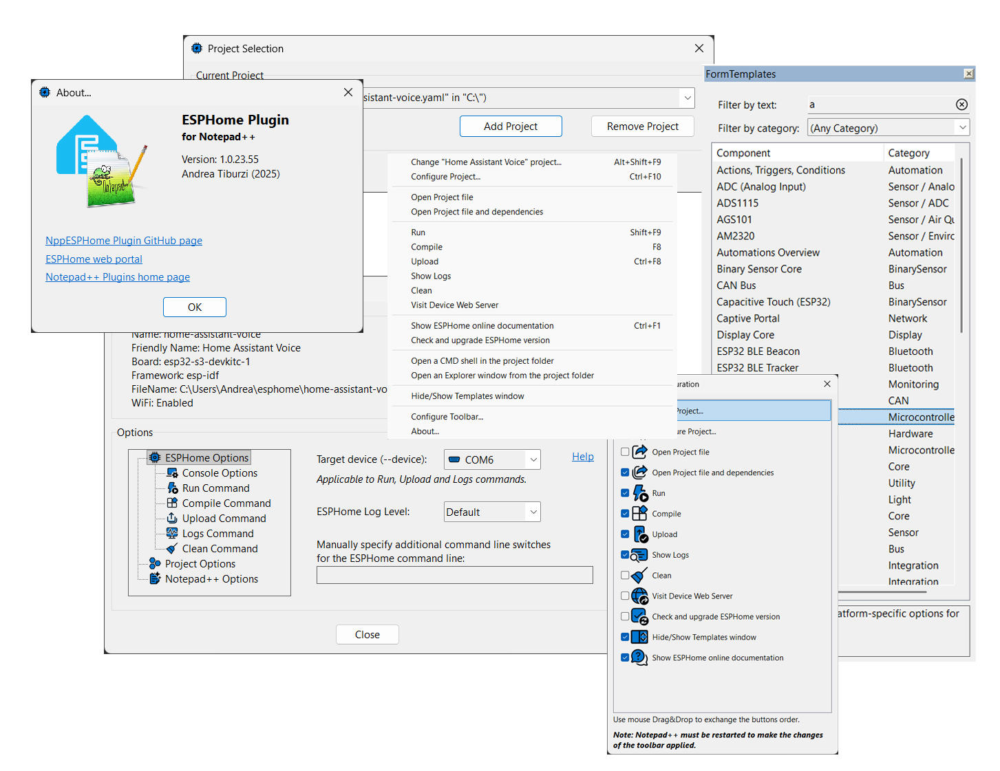
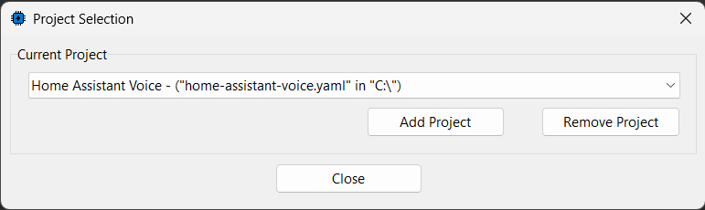
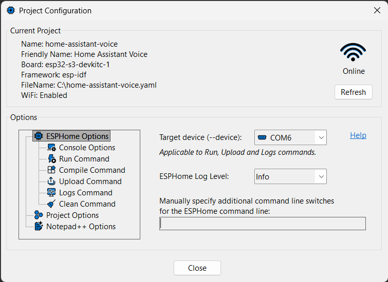

# NppESPHome-Plugin

A **Notepad++** plugin written in **Delphi** to directly interact with **ESPHome** and easily manage related projects in Windows environment.

## Why?

After discovering the potential of ESPHome, I started working on several projects and immediately ran into the lack of a tool that would help me speed up the development workflow, including writing YAML code and performing related testing.
Despite the power of the command line provided by both Python and ESPHome itself, I needed something that would save me from repeatedly rewriting the same commands, even if they were very simple.
At first, I developed a Windows application that acted as a wrapper, but I soon realized that by relying exclusively on Notepad++ for code editing, I could create a plugin that would make interaction with ESPHome commands immediate and straightforward.

That’s how the idea for this plugin was born.

## Features

* **Streamlined workflow** – Designed around the ESPHome project concept, the plugin ensures a smooth, intuitive, and productive development experience.

* **Project configuration dialogs** – Quickly select and configure your current project with dedicated setup windows directly inside Notepad++, fully supporting Light or Dark modes.

* **One-click ESPHome commands** – Automatically generates command lines for Run, Compile, Upload, Clean, and Logs. All commands are accessible from the plugin menu or can be assigned to custom keyboard shortcuts in Notepad++.

* **Smart YAML validation** – Parses your project’s YAML file to check validity and detect whether it includes Online or WebServer features.

* **Flexible device communication** – Configure ESP device communication ports with automatic detection of active serial and network connections, making uploads and interaction effortless.

* **Command customization** – Personalize options for each ESPHome command and save them with your project settings.

* **Advanced configuration** – Control logging behavior, automatic console closing, and define custom command-line arguments for advanced workflows.

* **Auto-save integration** – Automatically saves your project files before executing ESPHome commands, helping you keep focus on development.

* **Multi-source management** – Supports a project dependency file, enabling simultaneous editing of multiple sources within the same project, with multi-file open and save to boost productivity.

* **Custom Notepad++ toolbar** – An integrated, customizable toolbar provides direct access to the plugin’s main commands and functions.

* **Templates for ESPHome Components** – A dockable window displays a customizable list of ESPHome components, allowing for quick insertion into code template blocks and accelerating development.

* **Extra utilities** – Includes handy non-ESPHome features such as:
    - Opening the official ESPHome web documentation
    - Updating ESPHome to the latest version
    - Launching a command prompt or file explorer directly from the project folder

## What it does and doesn't do

The plugin does not replace ESPHome; instead, it simplifies interaction with it directly from Notepad++.  
For the plugin to work, **ESPHome must already be installed on your system**, and its executable must be available in the user or system PATH.  
As it is built for Notepad++, the editor must also be installed—version 8.0 or higher is required to enable toolbar functionality.

## Typical workflow

1.   Select one or more existing ESPHome projects by adding the corresponding YAML file through the **"Select Project"** plugin command.
    
2.   Choose the active project using the **"Select Project"** plugin command.
    
3.   Configure the current project by setting the relevant options for ESPHome and Notepad++ using the **"Configure Project"** command.
    
4.   Open the project file(s) in Notepad++ for development with the **"Open Project File & Dependencies"** function.
    
5.   Apply your changes.
    
6.   Execute "**Run**", "**Compile**", or "**Upload**" ESPHome commands as needed—either from the menu or through custom keyboard shortcuts.
    
7.   Explore the additional plugin commands and features to further support your development.

## The Application

### "Select Project" command

When the plugin is loaded, it retrieves from the configuration file the ESPHome project previously selected.  
You can select an existing project or add a new one to the list of known projects using the **"Select Project..."** function, which opens the following dialog:

The combo box displays all known ESPHome projects. The project currently selected in this list will be used across all plugin functionalities.  
To be selectable, a project must first be added to the list of known projects.

-   **Add a project:** click "Add Project" and choose the YAML file of your project. The file must contain valid ESPHome project content, which will be analyzed to extract the required information. If the file content is invalid, an error message will be shown and the project will not be added.
    
-   **Remove a project:** select it from the list and click "Remove Project".

### "Configure Project" command

Once the current project has been selected, you can proceed with its configuration by defining how the plugin should interact with ESPHome and with Notepad++.  
For example, you can decide the type of auto-save behavior for project files, configure how to handle console windows opened by ESPHome commands, customize the command line for each action, and much more.

These settings, defined on a per-project basis, are stored in the plugin’s configuration file.

### "Run", "Compile", "Upload", "Logs" and "Clean" commands
From the plugin menu, or through keyboard shortcuts in Notepad++, you can launch the five main ESPHome commands for the current project (**Run, Compile, Upload, Logs, Clean**).  
Normally, when working from a Windows console, you would need to invoke the `esphome.exe` command line manually and provide the correct sequence of required parameters.

The plugin automatically builds the command line with all the parameters required to run ESPHome, invoking the expected command.  
Stored configurations, project files, and the command itself are used to open the ESPHome console and execute the selected action.
The console (running in a Windows shell) can either remain open or close automatically, depending on the chosen settings.

## Installation

In case you just want to use the plugin as-is, and don't care to compile it yourself, you can download the [DLL](https://github.com/atiburzi/NppESPHome-Plugin/tree/main/Bin). 
The plugin DLL file should be placed in the plugins subfolder of the Notepad++ Install Folder, under the subfolder with the same name of plugin binary name without file extension, as per this [guide](https://npp-user-manual.org/docs/plugins/#install-plugin-manually). 

Pay attention to use the DLL plugin architecture corresponding to the Notepad++ architecture in use. (x32/x64) 
Moreover, remember that for the plugin to work, ESPHome must already be installed on the system. 
Here you can find the [ESPHome Installation Guide](https://www.esphome.io/guides/installing_esphome/).
If ESPHome is not found during Notepad++ startup, <ins>the plugin will display an error message.</ins> 

## Plugin settings
Settings are stored in the Notepad++ plugin settings default folder in **NppESPHome.ini** file.

## The Source
[The source](https://github.com/atiburzi/NppESPHome-Plugin/tree/main/Source) (written in Delphi) is available primarily so you can build your own custom versions.
I accept [pull requests](https://github.com/atiburzi/NppESPHome-Plugin/pulls) for bug fixes that I can reproduce or are obvious.  
Pull requests for new features or other changes are very welcome. 
Start by [creating an issue](https://github.com/atiburzi/NppESPHome-Plugin/issues).

### License
The source code is released under the MPL 2.0 license:
> Copyright © 2025 Andrea Tiburzi  
> This Source Code Form is subject to the terms of the Mozilla Public  
> License, v. 2.0. If a copy of the MPL was not distributed with this  
> file, You can obtain one at http://mozilla.org/MPL/2.0/.

### Environment
NppESPHome plugin has been compiled with Delphi 12 and tested with the following versions but probably it works with older (and newer) versions too:
  * Notepad++ 8.8.3
  * ESPHome 2025.3.0

### Dependencies to compile the source
Libraries to implement Notepad++ plugin have been partially taken from [NppUISpy plugin for Notepad++ ver. 1.2](https://github.com/dinkumoil/NppUISpy/tree/master/src/Lib) and modified to make them working for the case.

The following additional 3rd party libraries are required in order to compile the source:
  * [ComPort Library ver. 4.11](http://comport.sf.net/)
  * [LibYAML ver. 0.2.5](https://github.com/yaml/libyaml)
  * [JEDI Visual Component Library ver 3.50](https://github.com/project-jedi/jvcl)

Those libraries must be placed in the Delphi default library search path.

## Future enhancements
The plugin is already designed with multilingual support in mind. So far, I haven’t felt the need to implement it, but it could be added in the future without major effort.