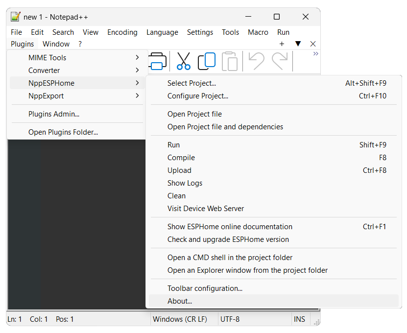

# NppESPHome-Plugin

A Notepad++ plugin written in **Delphi** to directly interact with **ESPHome** and easily manage related projects in Windows environment.

## Why?

After discovering the potential of ESPHome, I started working on several projects and immediately ran into the lack of a tool that would help me speed up the development workflow, including writing YAML code and performing related testing.
Despite the power of the command line provided by both Python and ESPHome itself, I needed something that would save me from repeatedly rewriting the same commands, even if they were very simple.

At first, I developed a Windows application that acted as a wrapper, but I soon realized that by relying exclusively on Notepad++ for code editing, I could create a plugin that would make interaction with ESPHome commands immediate and straightforward.

That’s how the idea for this plugin was born.

## Features

* Streamlined workflow – Designed around the ESPHome project concept, the plugin ensures a smooth, intuitive, and productive development experience.

* Project configuration dialogs – Quickly select and configure your current project with dedicated setup windows directly inside Notepad++, fully supporting Light or Dark modes.

* One-click ESPHome commands – Automatically generates command lines for Run, Compile, Upload, Clean, and Logs. All commands are accessible from the plugin menu or can be assigned to custom keyboard shortcuts in Notepad++.

* Smart YAML validation – Parses your project’s YAML file to check validity and detect whether it includes Online or WebServer features.

* Flexible device communication – Configure ESP device communication ports with automatic detection of active serial and network connections, making uploads and interaction effortless.

* Command customization – Personalize options for each ESPHome command and save them with your project settings.

* Advanced configuration – Control logging behavior, automatic console closing, and define custom command-line arguments for advanced workflows.

* Auto-save integration – Automatically saves your project files before executing ESPHome commands, helping you keep focus on development.

* Multi-source management – Supports a project dependency file, enabling simultaneous editing of multiple sources within the same project, with multi-file open and save to boost productivity.

* Custom Notepad++ toolbar – An integrated, customizable toolbar provides direct access to the plugin’s main commands and functions.

* Extra utilities – Includes handy non-ESPHome features such as:
    - Opening the official ESPHome web documentation
    - Updating ESPHome to the latest version
    - Launching a command prompt or file explorer directly from the project folder

## What it doesn't do

The plugin does not replace ESPHome but makes interaction with it easier.
For it to work, ESPHome must be installed on the system and its executables must be included in the user or system PATH.
Naturally, the plugin is designed for Notepad++, and therefore requires Notepad++ to be installed (version 8.0 or higher is needed to use the toolbar).

## Typical workflow

1. Identify one or more existing ESPHome project, adding related YAML file in the "Select Project" plugin function.
2. Select the current active project from the "Select Project" plugin function.
3. Configure the current project setting the related applicable options for ESPHome and Notepad++.
4. Load the project file(s) in Notepad++ for the related development (Open Project File & Dependencies function).
5. Make your changes.
6. Start your Run, Compile, Upload ESPHome commands as needed, from the menù or assign to those functionalities dedicated keybard shortcuts.
7. Enjoy the other commands/functions of the plugin to support your development.

## The Application

In case you just want to use the plugin as-is, and don't care to compile it yourself, you can download the DLL file here: [Binary](https://github.com/atiburzi/NppESPHome-Plugin/tree/main/Bin)

Settings are stored in the Notepad++ plugin settings default folder.

## The Source

[The source](https://github.com/atiburzi/NppESPHome-Plugin/tree/main/Source) is available primarily so you can build your own custom versions.

I will accept [pull requests](https://github.com/atiburzi/NppESPHome-Plugin/pulls) for bug fixes provided I can reproduce the problem or it is obvious.  
Pull requests for new features or other changes should be backed by well argued use cases. Start by [creating an issue](https://github.com/atiburzi/NppESPHome-Plugin/issues).

### License

The source code is released under the MPL 2.0 license:

> Copyright © 2025 Andrea Tiburzi  
> This Source Code Form is subject to the terms of the Mozilla Public  
> License, v. 2.0. If a copy of the MPL was not distributed with this  
> file, You can obtain one at http://mozilla.org/MPL/2.0/.

### Requirements

NppESPHome plugin has been tested with the following versions but probably works with older (and newer) versions too:

  * Notepad++ 8.8.3
  * ESPHome 2025.3.0
  * Python 3.13.1

### Dependencies

The following 3rd party libraries are required in order to compile the source:

  * [NppUISpy plugin for Notepad++ ver. 1.2 libraries](https://github.com/dinkumoil/NppUISpy/tree/master/src/Lib) - Customized
  * [ComPort Library ver. 4.11](http://comport.sf.net/)
  * [LibYAML ver. 0.2.5](https://github.com/yaml/libyaml)
  * [JEDI Visual Component Library ver 3.50](https://github.com/project-jedi/jvcl) - Only TJvCreateProcess component

The libraries must in the Delphi default library search path.

